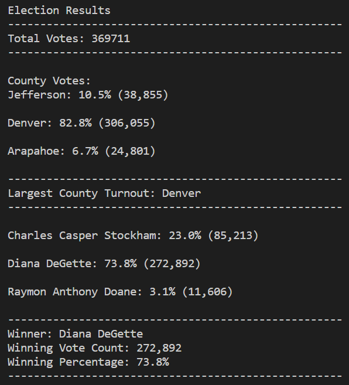

# Election_Analysis
## Overview of Election Audit
The Colorado Board of Elections tasked Tom and I to audit the results of a recent local election. This allowed the board to have technical data backing the results of the election. This audit also allowed the Colorado Board of elections to determine the representation of each county.

### Election Results

After the audit of the total 369,711 votes was complete, the following was determined:
* Denver had the highest county turnout of 306,055 ballots, which was equal to 82.8% of the votes.
* Diana DeGette collected 73.8% of the votes. This made her the clear winner, as she far exceed the 50.1% required to win.

